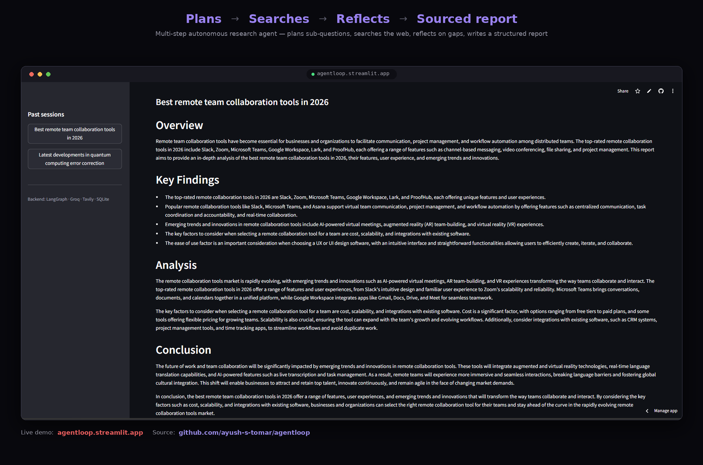

# AgentLoop

**A multi-step research agent with tool-use and memory.**

Most AI projects are input → output. AgentLoop is different — it plans, searches the live web, reflects on its own gaps, loops back if needed, then writes a structured report. Built to demonstrate agentic AI, not just LLM wrapping.

**Plans → Searches → Reflects → Sourced report**


🔗 **[Live Demo](https://agentloop.streamlit.app)** · 📦 **[Source](https://github.com/ayush-s-tomar/agentloop)**



<details>
<summary><strong>▶ Watch the 75s demo video</strong></summary>
<br>

https://github.com/user-attachments/assets/d13b785b-27c6-40dc-ad06-05f1a9fc3d43

</details>

---

## What it does

Give it any topic. The agent runs a 6-step pipeline autonomously:

| Step | What happens |
|------|-------------|
| **Recall** | Checks SQLite long-term memory for related past research |
| **Plan** | LLM breaks the topic into specific sub-questions |
| **Research** | For each sub-question, LLM *decides* whether to call `web_search` (Tavily), reads results, writes a cited answer |
| **Reflect** | Re-reads its own notes, identifies gaps, loops back to research if needed |
| **Synthesize** | Writes a structured markdown report from everything gathered |
| **Persist** | Saves the run to long-term memory for future recall |

```
START → recall → planner → research ←─────────┐
                               │               │ (loop while sub-questions remain)
                               ▼               │
                            reflect ───────────┘ (loop back if gaps found)
                               │
                               ▼
                          synthesize → persist → END
```

---

## Stack

| Layer | Technology |
|-------|-----------|
| Agent framework | LangGraph (StateGraph with conditional edges) |
| LLM + tool-calling | Groq (`llama-3.1-8b-instant`, configurable) |
| Web search tool | Tavily API |
| UI | Streamlit |
| Long-term memory | SQLite |
| Deploy | Streamlit Community Cloud |

---

## Project structure

```
agentloop/
├── streamlit_app.py     Streamlit UI — input, live trace, report, session history
├── agent/
│   ├── state.py         AgentState schema shared across all graph nodes
│   ├── graph.py         LangGraph StateGraph: nodes + conditional routing
│   ├── llm.py           LLM wrapper: plain completions + tool-calling loop
│   └── tools.py         web_search tool (Tavily) + OpenAI-compatible schema
├── memory/
│   └── store.py         SQLite long-term memory (save, recall, clear past sessions)
├── requirements.txt
└── .env.example
```

---

## Run locally

```bash
# 1. Clone and enter the project
git clone https://github.com/ayush-s-tomar/agentloop.git
cd agentloop

# 2. Create virtual environment (Python 3.11+ required)
python3.11 -m venv venv
source venv/bin/activate        # Windows: venv\Scripts\activate

# 3. Install dependencies
pip install -r requirements.txt

# 4. Add your API keys
mkdir -p .streamlit
cat > .streamlit/secrets.toml << 'EOF'
GROQ_API_KEY = "your_groq_api_key_here"
TAVILY_API_KEY = "your_tavily_api_key_here"
GROQ_REASON_MODEL = "llama-3.1-8b-instant"
EOF

# 5. Start the app
streamlit run streamlit_app.py

# 6. Open http://localhost:8501
```

Free API keys (no credit card needed):
- Groq → https://console.groq.com/keys
- Tavily → https://app.tavily.com

---

## Deploy to Streamlit Community Cloud

1. Fork/clone this repo and push to GitHub
2. Go to [share.streamlit.io](https://share.streamlit.io) → New app → connect repo
3. Set main file path: `streamlit_app.py`
4. In **Advanced settings → Secrets**, add:
   ```toml
   GROQ_API_KEY = "your_groq_api_key_here"
   TAVILY_API_KEY = "your_tavily_api_key_here"
   GROQ_REASON_MODEL = "llama-3.1-8b-instant"
   ```
5. Deploy

> **Note:** Streamlit Community Cloud has ephemeral storage — SQLite memory resets on redeploy/restart. For persistent memory across restarts, swap `memory/store.py` for a hosted DB (e.g. Supabase Postgres).

---

## What makes this agentic

- **Real tool-calling** — the LLM is given a tool schema and decides per sub-question whether and how to call `web_search`. It's not a hardcoded "always search" pipeline. See `agent/llm.py::should_search`, which is biased to search on any time-sensitive question (prices, versions, "current/latest") and falls back to a keyword check so a wrong LLM answer can't silently skip real data.
- **Conditional looping** — LangGraph conditional edges route `research → research` while sub-questions remain, and `reflect → research` if the agent finds gaps in its own notes.
- **Two kinds of memory** — short-term (notes accumulated within one run's state) and long-term (SQLite, persisted across runs, checked via keyword-overlap at the start of every new run). A "Clear history" control in the sidebar wipes long-term memory on demand.
- **Observability** — every node emits a trace event that streams live to the UI, showing exactly what the agent is doing at each step.

---

## What I'd add next

- Vector-based memory recall (pgvector / Chroma) instead of keyword overlap
- A second tool (calculator, doc retrieval) to show the agent choosing *between* tools
- Token-level streaming within each node for fully real-time output
- Eval harness with LLM-as-judge rubric to catch prompt regressions
- Persistent (non-ephemeral) memory backend for the hosted deployment
